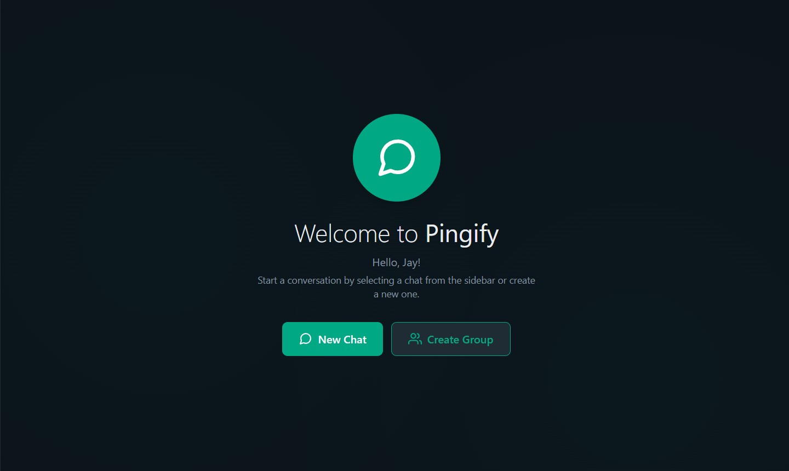
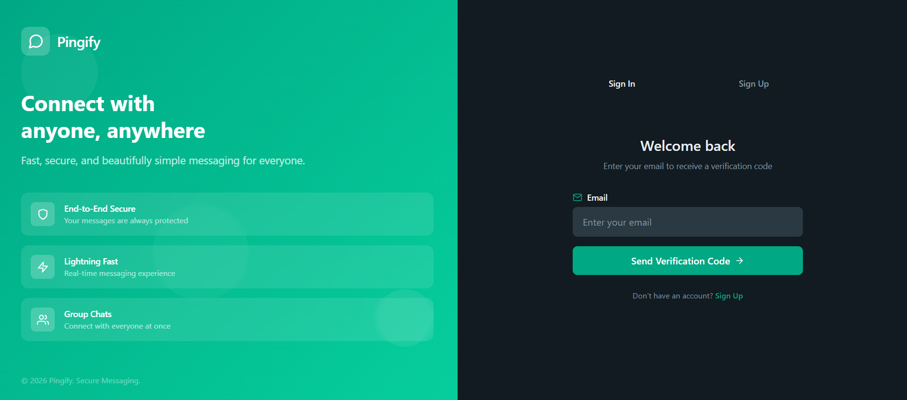
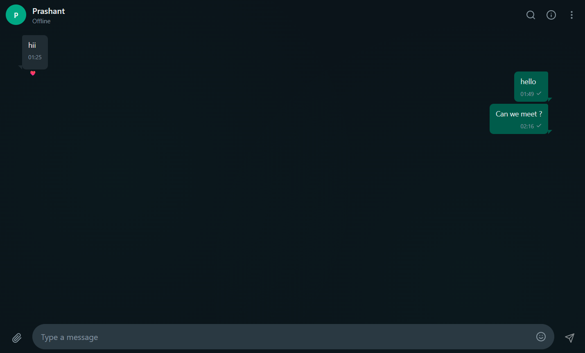

# Pingify - Real-time Chat Application

A complete MERN stack real-time chat application with modern architecture, glassmorphic UI, and advanced messaging features.

## 🚀 Features

### Core Messaging
- **Real-time Messaging**: Socket.io powered instant messaging with live updates
- **Private & Group Chats**: Seamless 1:1 conversations and group discussions
- **Typing Indicators**: See when someone is typing in real-time
- **Message Read Receipts**: Track message delivery and read status (sent ✓, delivered ✓✓, read ✓✓)
- **Online/Offline Status**: Real-time user presence indicators
- **End-to-End Encryption**: Secure 1:1 messaging using Web Crypto API (E2EE)
- **E2EE Key Management**: Automatic key pair generation and public key exchange

### Advanced Message Features
- **Edit Messages**: Modify sent messages with edit history
- **Delete Messages**: Remove messages with soft delete support
- **Message Reactions**: Quick emoji reactions (👍, ❤️, 😂, 😮, 😢, 🙏)
- **Reply to Messages**: Thread-like reply functionality with context
- **Forward Messages**: Share messages across multiple chats
- **Star Messages**: Bookmark important messages
- **Message Search**: Full-text search within conversations
- **Message Types**: Support for text, images, videos, files, and audio

### File & Media Sharing
- **Multi-format Support**: Upload and share images, videos, documents, and audio files
- **Cloudinary Integration**: Secure cloud storage for media files
- **File Preview**: Preview images and files before sending
- **Media Gallery**: View all shared media in chat info panel

### Group Management
- **Create Groups**: Start group conversations with custom names and descriptions
- **Member Management**: Add/remove members with search functionality
- **Role-based Permissions**: Admin, moderator, and member roles
- **Group Settings**: Edit group name, description, and avatar
- **Transfer Ownership**: Transfer group admin rights
- **Leave Group**: Exit group conversations
- **Group Info Panel**: View members, media, and group details

### User Features
- **User Search**: Find users by username or email
- **Profile Management**: Customize profile with avatar, username, and status
- **Block/Unblock Users**: Privacy controls for user interactions
- **Settings Page**: Configure application preferences
- **Avatar Upload**: Custom profile pictures with Cloudinary storage

### Notifications
- **Real-time Notifications**: Instant notifications powered by Redis
- **Unread Message Counts**: Track unread messages per chat
- **Notification Dropdown**: Quick access to recent notifications
- **Mute Notifications**: Control notification preferences per chat
- **Email Notifications**: Fallback email notifications for important events

### Authentication & Security
- **JWT Authentication**: Secure token-based authentication
- **Refresh Tokens**: Automatic token refresh mechanism
- **Email Verification**: Verify email addresses on registration
- **Password Reset**: Secure password recovery via email
- **Role-based Access**: User and admin role management
- **Rate Limiting**: API rate limiting for security
- **Input Validation**: Zod schema validation for all inputs
- **Password Hashing**: Argon2 secure password hashing

### UI/UX
- **Glassmorphic Design**: Modern glassmorphism UI with backdrop blur effects
- **Responsive Layout**: Mobile-friendly responsive design
- **Smooth Animations**: Framer Motion powered transitions
- **Dark/Light Theme Support**: TailwindCSS based styling
- **Emoji Picker**: Built-in emoji picker for messages
- **Chat Sidebar**: Quick access to all conversations
- **Info Panel**: Detailed chat information and media gallery


## 📸 Screenshots

### Dashboard


### Registration & Onboarding


### Individual Chat Interface


## 📁 Project Structure

```
Pingify/
├── backend/
│   ├── src/
│   │   ├── modules/
│   │   │   ├── auth/          # Authentication module
│   │   │   ├── users/          # User management
│   │   │   ├── chats/          # Chat management
│   │   │   ├── messages/       # Message handling
│   │   │   ├── groups/         # Group management
│   │   │   ├── notifications/  # Notification system
│   │   │   └── files/          # File upload handling
│   │   ├── config/             # Configuration files
│   │   │   ├── db.js          # MongoDB connection
│   │   │   ├── redis.js       # Redis connection
│   │   │   ├── env.js         # Environment variables
│   │   │   └── logger.js      # Winston logger config
│   │   ├── middlewares/        # Express middlewares
│   │   │   ├── auth.middleware.js
│   │   │   ├── error.middleware.js
│   │   │   ├── rateLimiter.middleware.js
│   │   │   └── requestLogger.middleware.js
│   │   ├── utils/              # Utility functions
│   │   │   ├── AppError.js
│   │   │   ├── cloudinary.js
│   │   │   ├── email.js
│   │   │   ├── socket.js
│   │   │   └── ensureUploadDirs.js
│   │   ├── uploads/            # Local file storage
│   │   ├── logs/               # Application logs
│   │   ├── app.js              # Express app configuration
│   │   └── server.js           # Server entry point
│   └── package.json
├── frontend/
│   ├── src/
│   │   ├── app/                # Page components
│   │   │   ├── auth/          # Authentication pages
│   │   │   ├── chat/          # Chat page
│   │   │   ├── layout/        # Layout components
│   │   │   ├── page/          # Home page
│   │   │   ├── profile/       # Profile page
│   │   │   └── settings/      # Settings page
│   │   ├── components/         # Reusable components
│   │   │   ├── chat/         # Chat-specific components
│   │   │   ├── layout/       # Layout components
│   │   │   └── notifications/ # Notification components
│   │   ├── store/             # Redux store
│   │   │   └── slices/       # Redux slices
│   │   ├── services/          # API services
│   │   ├── hooks/             # Custom React hooks
│   │   ├── utils/             # Utility functions
│   │   └── styles/            # Global styles
│   ├── dist/                  # Build output
│   └── package.json
└── README.md
```

## 🛠️ Tech Stack

### Backend
- **Runtime**: Node.js (v18+)
- **Framework**: Express.js
- **Database**: MongoDB with Mongoose ODM
- **Real-time**: Socket.io
- **Cache**: Redis
- **Authentication**: JWT (jsonwebtoken)
- **Password Hashing**: Argon2
- **File Upload**: Multer
- **Cloud Storage**: Cloudinary
- **Logging**: Winston with daily rotation
- **Validation**: Zod
- **Security**: Helmet, CORS, Rate Limiting
- **Email**: Nodemailer

### Frontend
- **Framework**: React 18.2
- **Build Tool**: Vite
- **State Management**: Redux Toolkit
- **Routing**: React Router v6
- **Real-time**: Socket.io-client
- **Styling**: TailwindCSS
- **Animations**: Framer Motion
- **HTTP Client**: Axios
- **Notifications**: React Hot Toast
- **Emoji Picker**: emoji-picker-react
- **Icons**: React Icons
- **Date Formatting**: date-fns

## 📦 Installation

### Prerequisites
- Node.js (v18 or higher)
- MongoDB (local or cloud instance)
- Redis (local or cloud instance)
- Cloudinary account (for media storage)
- Email service (Gmail or similar for email verification)

### Backend Setup

1. Navigate to backend directory:
```bash
cd backend
```

2. Install dependencies:
```bash
npm install
```

3. Create environment file:
```bash
cp .env
```

4. Configure environment variables (see Environment Variables section below)

5. Start the development server:
```bash
npm run dev
```

The backend server will run on `http://localhost:5000`

### Frontend Setup

1. Navigate to frontend directory:
```bash
cd frontend
```

2. Install dependencies:
```bash
npm install
```

3. Start the development server:
```bash
npm run dev
```

The frontend will run on `http://localhost:5173`

## ⚙️ Environment Variables

### Backend (.env)

Create a `.env` file in the `backend` directory with the following variables:

```env
# Server Configuration
PORT=5000
NODE_ENV=development

# Database
MONGODB_URI=mongodb://localhost:27017/pingify

# Redis Configuration
REDIS_HOST=localhost
REDIS_PORT=6379

# JWT Secrets
JWT_SECRET=your-super-secret-jwt-key-change-in-production
JWT_REFRESH_SECRET=your-super-secret-refresh-key-change-in-production
JWT_EXPIRES_IN=15m
JWT_REFRESH_EXPIRES_IN=7d

# Cloudinary Configuration
CLOUDINARY_CLOUD_NAME=your-cloudinary-cloud-name
CLOUDINARY_API_KEY=your-cloudinary-api-key
CLOUDINARY_API_SECRET=your-cloudinary-api-secret

# Email Configuration (Gmail example)
EMAIL_USER=your-email@gmail.com
EMAIL_PASS=your-app-specific-password
EMAIL_FROM=noreply@pingify.com

# Frontend URL
FRONTEND_URL=http://localhost:5173

# CORS Configuration
CORS_ORIGIN=http://localhost:5173
```

### Frontend Environment

The frontend uses the API URL from the backend. Update the API base URL in `frontend/src/services/api.js` if needed.

## 🎨 Features Overview

### Authentication
- ✅ User registration with email verification
- ✅ Secure login with JWT tokens
- ✅ Refresh token mechanism
- ✅ Password reset via email
- ✅ Forgot password functionality
- ✅ Email verification on signup
- ✅ Protected routes and API endpoints

### Chat Features
- ✅ Real-time bidirectional messaging
- ✅ Typing indicators
- ✅ Message read receipts (sent/delivered/read)
- ✅ Edit sent messages
- ✅ Delete messages (soft delete)
- ✅ Message reactions with emojis
- ✅ Reply to specific messages
- ✅ Forward messages to multiple chats
- ✅ Star/bookmark messages
- ✅ Search messages within chats
- ✅ Online/offline user status
- ✅ Message timestamps and formatting

### Group Features
- ✅ Create groups with name and description
- ✅ Add/remove group members
- ✅ Admin and moderator roles
- ✅ Transfer group ownership
- ✅ Edit group information
- ✅ Leave group
- ✅ Group avatar upload
- ✅ View group members and details
- ✅ Promote/demote moderators

### Media & Files
- ✅ Image upload and preview
- ✅ Video file support
- ✅ Document file sharing
- ✅ Audio file support
- ✅ Cloudinary cloud storage
- ✅ File type detection
- ✅ Media gallery in chat info
- ✅ File size validation

### User Management
- ✅ User profile with avatar
- ✅ Update username and status
- ✅ Search users by username/email
- ✅ Block/unblock users
- ✅ View user online status
- ✅ User settings page

### Notifications
- ✅ Real-time notification system
- ✅ Unread message counts
- ✅ Notification dropdown
- ✅ Mark notifications as read
- ✅ Delete notifications
- ✅ Mute chat notifications
- ✅ Email notification fallback


## 🔒 Security Features

- **Helmet.js**: Security headers protection
- **CORS**: Configured cross-origin resource sharing
- **Rate Limiting**: API rate limiting to prevent abuse
- **Input Validation**: Zod schema validation for all inputs
- **Password Security**: Argon2 password hashing
- **JWT Authentication**: Secure token-based authentication
- **Refresh Tokens**: Automatic token refresh mechanism
- **Socket.io Authentication**: Authenticated WebSocket connections
- **File Upload Validation**: File type and size validation
- **SQL Injection Prevention**: Mongoose ODM protection
- **End-to-End Encryption**: 1:1 messages are encrypted on the sender's device and decrypted only on the receiver's device using RSA-OAEP and AES-GCM (Web Crypto API).
- **Client-side Key Storage**: Private keys never leave the user's browser (stored in LocalStorage).
- **XSS Protection**: Input sanitization and secure coding practices.

## 📊 Logging

- **Winston Logger**: Comprehensive logging system
- **Daily Log Rotation**: Automatic log file rotation
- **Log Levels**: Error, warn, info, debug
- **Request Logging**: HTTP request/response logging
- **Error Logging**: Detailed error stack traces
- **Log Storage**: Logs stored in `/backend/logs` directory

## 🚀 Deployment

### Backend Deployment

1. Set all environment variables in your hosting platform
2. Ensure MongoDB and Redis are accessible
3. Build and start the server:
```bash
npm start
```

### Frontend Deployment

1. Update API base URL in environment configuration
2. Build the application:
```bash
npm run build
```
3. Deploy the `dist` folder to your hosting platform (Vercel, Netlify, etc.)

### Recommended Platforms
- **Backend**: Render
- **Frontend**: Vercel
- **Database**: MongoDB Atlas
- **Redis**: Redis Cloud
- **Storage**: Cloudinary

## 🧪 Development

### Running in Development Mode

**Backend:**
```bash
cd backend
npm run dev
```

**Frontend:**
```bash
cd frontend
npm run dev
```

### Code Structure
- **Modular Architecture**: Feature-based module organization
- **Separation of Concerns**: Clear separation between routes, controllers, services, and models
- **Error Handling**: Centralized error handling middleware
- **Validation**: Request validation using Zod schemas
- **Type Safety**: Consistent data structures

## 📄 License

MIT License - feel free to use this project for personal purpose.

## 👥 Contributing

Contributions are welcome! Please feel free to submit a Pull Request. For major changes, please open an issue first to discuss what you would like to change.

---